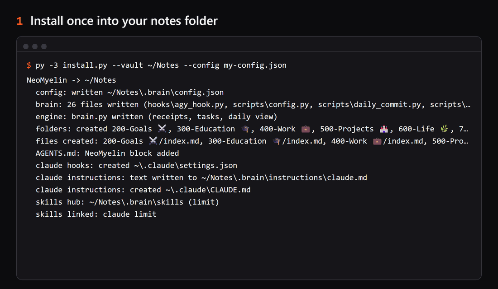
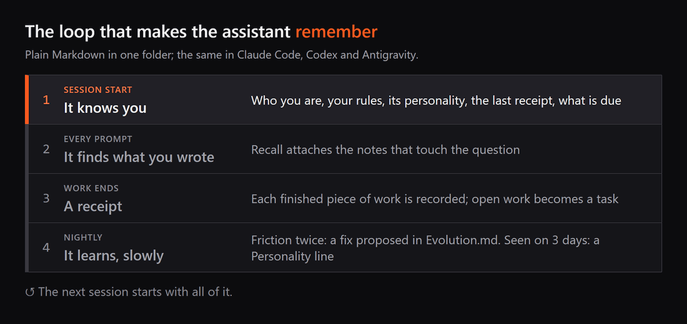

# 🧠 NeoMyelin

**Your AI assistant remembers you between sessions, finds what you wrote, and changes only when
your own behaviour shows it should.**



Think of a colleague who keeps a notebook about your work. Each morning they reread who you are
and where you stopped. When you ask something, they open the page that answers it. Each night
they look at what went wrong twice and suggest a fix. NeoMyelin gives that notebook to the AI
assistant you already use: Claude Code, Codex or Antigravity.

- **It remembers.** Each session starts with who you are, your rules, the last receipt of the
  project you are in and what is due. Each prompt brings the notes that touch it.
- **Your files, in plain Markdown.** Notes, receipts and tasks live in one folder that you read and
  edit in [Obsidian](https://obsidian.md), the free notes app. They stay on your machine.
- **It changes only on evidence.** A personality line needs the same thing seen on three different
  days, with quotes. A fix for repeated friction is proposed; you accept or reject it.

It is my own second brain, shipped empty: the mechanisms and the folder structure of the system I
use every day for school, work and life, with none of my data. Updates come from new NeoMyelin
releases. MIT licensed.

## Install: one folder, one message

1. Install [Obsidian](https://obsidian.md) and create a new vault in it (or open the notes folder
   you already keep as a vault). That folder is your vault.
2. Open that folder in Claude Code, Codex or Antigravity.
3. Paste:

> Read https://raw.githubusercontent.com/Estaed/neomyelin/main/INSTALL.md and install NeoMyelin in
> this folder. Ask me what you need, and finish by checking it works.

The agent asks your name, your assistant's name, the language and the status line, offers to
install the Claude Code, Codex or Antigravity CLI you lack and to back the vault up to a private
GitHub repository, downloads the release and checks its checksum, installs, and walks you through
the one trust step your client needs.

## How it works



1. **Session start:** a hook prints who you are, your rules, the assistant's personality, the last
   receipt of the project you are in and what is due. In any folder, not only the vault.
2. **Every prompt:** recall attaches the vault notes that touch the question. Pure Python search
   out of the box; better matches when [Ollama](https://ollama.com) with `bge-m3` is running.
3. **Work ends:** `brain.py`, a small engine at the vault root, records the finished work as a
   receipt (secrets in it masked), keeps tasks with their history, and rebuilds a daily log.
4. **Nightly:** repeated friction becomes a proposed fix in `Evolution.md`; a habit seen on three
   different days becomes a line in `Personality.md`; lessons a session forgot become knowledge
   notes. It needs no scheduler: it starts in the background at your first session after the time
   you chose.

<details>
<summary>Everything it installs, feature by feature</summary>

| | |
|---|---|
| **Memory in every session** | Each new session starts with who you are, your rules, the assistant's personality, the last receipt of the project you are in and what is due. In any folder, not only the vault. |
| **Receipts, tasks and a daily log** | `brain.py`, a small engine at the vault root, records each finished piece of work as a receipt (secrets in it masked), keeps tasks with their revision history, and rebuilds a readable daily log from the receipts. Plain Markdown files you can open anywhere. |
| **Recall on every prompt** | The notes that touch your question are attached before the assistant answers. Pure Python search out of the box; better matches automatically when [Ollama](https://ollama.com) with `bge-m3` is running. |
| **A personality that is earned** | The assistant records what it notices about how you work. A line enters `Personality.md` only when the same thing shows on **three different days**, with the quotes as evidence. Any line can be vetoed and never comes back. |
| **Friction becomes proposals** | When the assistant trips on the same thing twice, the nightly run writes a proposed fix into `Evolution.md` for you to accept or reject. Lessons a session forgot to file become knowledge notes. |
| **A structure for your whole life** | `200-Goals`, `300-Education`, `400-Work`, `500-Projects`, `600-Life`, `700-Private`, `800-Arsenal`, `900-Archive`, and a map in `AGENTS.md` that tells the assistant where each kind of note goes. |
| **House rules in every session** | A short set of rules in the vault (`.brain/instructions/`) tells the assistant when to write a receipt, recall, and record friction, plus four working principles. Your user-level `CLAUDE.md` imports it; Codex `AGENTS.md` and Antigravity's `GEMINI.md` get a copy. Your own lines in those files stay as they are. |
| **One home for your skills** | Skills live in the vault's `.brain/skills/`: linked into Claude Code and Codex, and named in Antigravity's `skills.json`, so a skill edited once is the same in all three. The install can move the skills you already have into it: each is backed up first, and uninstalling puts it back. |
| **Guard rails** | A receipt reminder at the end of real work, and two gates that refuse silent damage (a git command that wipes the working tree, a shell heredoc that mangles backslashes). |
| **Health and quota** | `doctor.py` checks the whole layer and the session start tells you when something broke; `limit` shows Claude, Codex and Antigravity quota from any folder; an optional two-line status line for Claude Code. |

</details>

## What is kept safe

- Installing into a folder that already holds notes adds NeoMyelin's folders and files next to
  them; nothing of yours is overwritten, moved or deleted, and the install names what it kept.
- Your settings files get only NeoMyelin's entries, next to yours, with a backup before any change.
- Your skills are moved only when you ask (`--adopt-skills`), each copied to `.brain/.backup/`
  first; two different skills under one name are left where they are. A skill link is removed on
  its own, never by deleting through it.
- Generated lines are marked; your own lines in `Personality.md` and `Evolution.md` are never
  rewritten.
- Nothing leaves your machine except the model calls your own client makes, and the quota reads
  `limit` makes when you run it: Claude's usage endpoint with your Claude login (the optional
  status line asks it too, at most every five minutes), `codex app-server` for Codex's reset
  credits, and `agy -p /usage`, which asks Antigravity's servers for your quota without a model
  turn.

## Requirements and status

Python 3.11+ (standard library only) and one of Claude Code, Codex, Antigravity.
Tested on Windows and on Linux (Ubuntu under WSL); macOS is written for but not tested yet. On
Linux, Antigravity installed as a snap gets the house rules but not the hooks (snap confinement
hides the system Python); install it outside snap for full memory.

NeoMyelin ships the brain, not the owner's skills (project planning, overnight runs, research,
delegation, design): they change every week and fit one person's way of working. Build your own
project road on top of the brain; the nightly run turns repeated friction into candidate fixes,
a patch to one of your skills among them.

## Manual install, updating, uninstalling

<details>
<summary>Manual install from a release</summary>

From an unpacked [release](https://github.com/Estaed/neomyelin/releases/latest) (check the ZIP
against its `.sha256`), with your own names in a copy of `templates/config.example.json`:

```sh
python3 install.py --vault "/path/to/vault" --config my-config.json        # macOS / Linux
py -3 install.py --vault "C:\Notes\MyVault" --config my-config.json --statusline   # Windows
```

The report lists skills of your own it found in your harnesses' skill folders; run the same
command again with `--adopt-skills` to move them into `.brain/skills/` (backed up first). Then
approve the hooks once in Codex (`/hooks`) if you use it; Antigravity needs no step (if it asks to
trust the vault folder, accept). Run `python3 .brain/scripts/doctor.py` (`py -3` on Windows) in
the vault, and open the vault folder in [Obsidian](https://obsidian.md) (Open folder as vault).

</details>

<details>
<summary>Updating to a new release</summary>

Run the install again from the new release, without `--config`: it reuses the vault's own
`.brain/config.json`.

```sh
python3 install.py --vault "/path/to/vault"        # macOS / Linux
py -3 install.py --vault "C:\Notes\MyVault"        # Windows
```

It is idempotent: unchanged files are not rewritten, every settings file it changes is backed up
first, and your notes, receipts, personality lines and own entries are never touched.

</details>

<details>
<summary>Uninstalling, and moving or deleting the vault</summary>

From an unpacked release (download it again if you deleted it after installing):

```sh
python3 uninstall.py --vault "/path/to/vault"      # macOS / Linux
py -3 uninstall.py --vault "C:\Notes\MyVault"      # Windows
```

It takes back what install wrote outside the vault: its hook entries and status line, the
instruction block in each harness's instruction file, the skill links and the entry in
Antigravity's `skills.json`. Each skill it moved into the hub goes back where it came from, as a
real folder. Your own hooks, text and skills stay, and every file it changes is backed up first.

**Moving or deleting the vault:** uninstall first, then move it and install again from the new
place. The hooks name the vault's path; if the folder is gone, Claude Code refuses every prompt
until they are removed. Already moved or deleted it? Run `uninstall.py --vault <the old path>`:
it works without the folder and removes everything that points at it.
The vault itself is left as it is, notes, receipts, `.brain/skills/` and all; delete the folder
yourself if you want it gone.

</details>

## Credits

NeoMyelin is inspired by Avenox V3 (MIT) by [Avenox](https://github.com/avenoxai); I built my own
on top of what I learned there. Several of its ideas (receipts, companion files, one vault for every
client) come from Avenox's work, and the receipt and task files keep its format. No Avenox code is
in this repository. NeoMyelin is MIT licensed.
